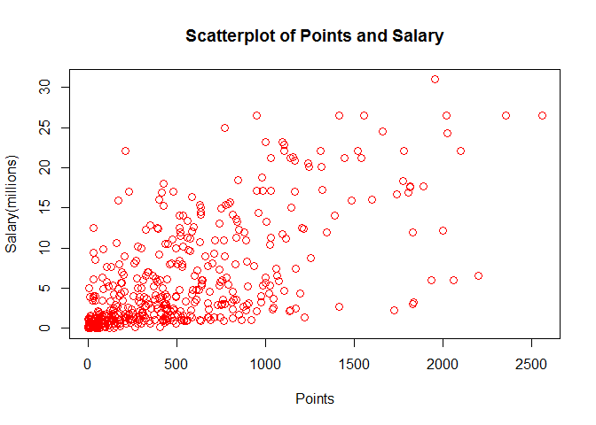
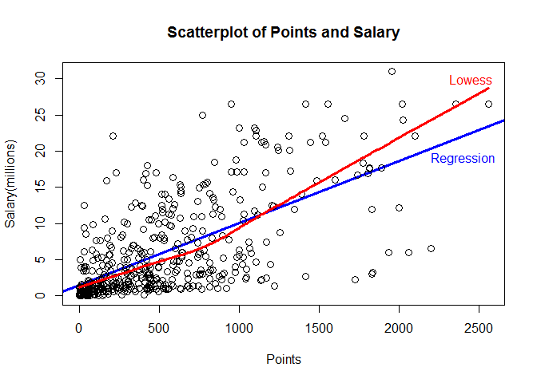
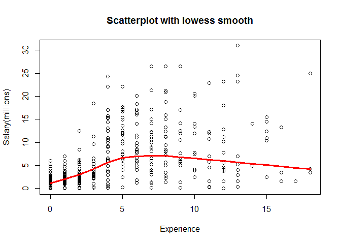
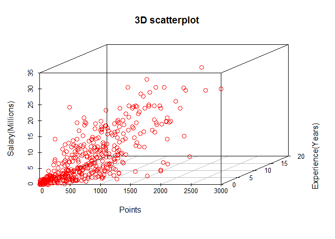
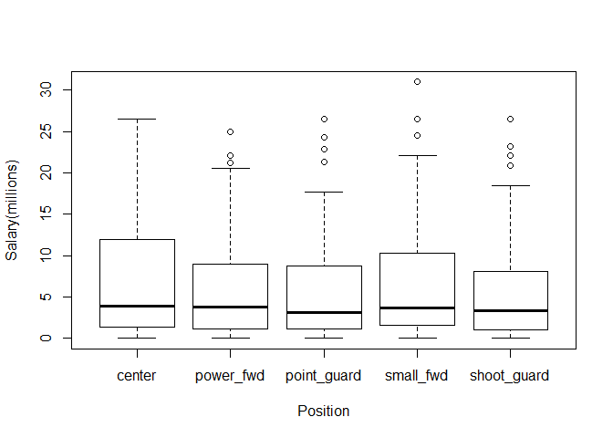

hw01-Pinshuo-Ye
================
Pinshuo Ye
9/21/2017

#### Data

The data objects for this assignment are in the file nba2017-salary-points.RData, inside the data folder of the hw01 directory of your stat133-hws-fall17 repo. There is also the data dictionary file nba2017-salary-points-dictionary.md.

#### Importing the data

You don’t need to download any data file (since it’s already in your local repository). To import the data, you just need to use load(). Assuming that your Rmd file is already saved inside the hw01 folder, you can load the .RData file with the following command (put it inside a code chunk):

``` r
# load data file 
load("data/nba2017-salary-points.RData") 
```

Call ls() to list the objects contained in the .RData:

``` r
# list the available objects
ls()
```

    ## [1] "experience" "player"     "points"     "points1"    "points2"   
    ## [6] "points3"    "position"   "salary"     "team"

### Research Question

#### 1) A bit of data preprocessing

``` r
# create a new salary variable measured in millions of dollars, up to 2 decimal digits
salary_millions <- salary/1000000
salary_millions <- as.numeric(salary_millions, nsmall = 2)
```

``` r
#replace all the R value to character 0
experience <- replace(experience, experience[] == "R", "0")

#change all the character to integer value
experience_int <- as.integer(experience)
experience_int
```

    ##   [1]  9 11  6  0  9  5  4  2  0  6  1  3  2  1  4 10 12 11  5  1  5 12 13
    ##  [24]  0  8 13  5 13 15  5  2  5  1  7  7  0  0  4 10  2  1  5  0  6  7  2
    ##  [47]  4  7  1  0  8  8  6  9  5  3  0  0  3  0  3 12  8 11  4 12  0 14  3
    ##  [70] 10  3 10  3  3  6  2 17  4  4  0  3  8  4  1  9  0  3  8 12 11  0  7
    ##  [93]  1  6  6  5 11  1  6  1  9  8  1  1  1  0 13  3  1  5  2  3  2  0 10
    ## [116]  8  4  8  4  7  9  1  1  6  0  0  2 13  7  1  4  4 12  1  1  0  6  5
    ## [139]  3  5  0  3  5  1  5  4  1  1  3  1  4  2  5  9 11  4  4  8  9  0 13
    ## [162]  0  8  7  9  3  1  4  5  0  0  0  0  9  0  2  5  9  8  2  2  4  8  7
    ## [185]  0  1  5  0  0  4  0  0  7  1  8  0  1  2  1  3  4  0  1  6  0  4  3
    ## [208]  8  0  0  6  2  2  2  4 10  1  2  2  6 12  0 13  4  3  2  8  9  1  5
    ## [231] 13  0 11  7 13  0  7 11  0  0  3  9  1  5  2 10 14  7 15 15  2  0  2
    ## [254]  8  0  7  0 11  1  4  8  1 12  0  7  4  6 11  0 11  8  0 10 16  8  8
    ## [277] 18 11  6  5 13  1  6  8  6  3  2 15  0  1  2  3  5  1  0  3  0  2  5
    ## [300]  2  1  4 12  5  8  0  3  7  3  0  8  5  0  2  2  1  8  9 12  3 18  0
    ## [323]  0 15  6  3  3  4  6  6  0  2  4  4  2  1  2  0  7  7  1  2  0 12  0
    ## [346]  5  0  3 16  1  8  4  8  6  4  1  0  7  6  4  5  4  7  6  0  3  2  0
    ## [369]  3 12 18  0  2  4 10  0  2  0  1  3  7  0  8  9  3  0  7  6  0  8  2
    ## [392]  0 10  0  7  7  1  2  2  8  6  3  7  1  0  1  7  5  3  1  2  0  9  1
    ## [415]  0  0  2  2  1 12 16  9  2  4  6  2  1  3  5  0  1  0  2  6  9 13  0
    ## [438] 11  2  0 15

``` r
# create a new factor based on the vector position
position1 <- as.factor(position)

# change the level name of the factor
levels(position1) <- c("center", "power_fwd", "point_guard", "small_fwd", "shoot_guard")
position1
```

    ##   [1] center      power_fwd   shoot_guard point_guard small_fwd  
    ##   [6] point_guard small_fwd   shoot_guard small_fwd   power_fwd  
    ##  [11] power_fwd   center      shoot_guard point_guard center     
    ##  [16] center      small_fwd   point_guard power_fwd   center     
    ##  [21] shoot_guard shoot_guard small_fwd   point_guard power_fwd  
    ##  [26] shoot_guard point_guard small_fwd   small_fwd   center     
    ##  [31] small_fwd   shoot_guard point_guard shoot_guard small_fwd  
    ##  [36] point_guard center      center      point_guard center     
    ##  [41] shoot_guard small_fwd   power_fwd   power_fwd   power_fwd  
    ##  [46] small_fwd   shoot_guard point_guard power_fwd   center     
    ##  [51] center      center      point_guard center      power_fwd  
    ##  [56] small_fwd   shoot_guard shoot_guard point_guard small_fwd  
    ##  [61] point_guard center      power_fwd   point_guard small_fwd  
    ##  [66] power_fwd   point_guard small_fwd   center      power_fwd  
    ##  [71] power_fwd   small_fwd   shoot_guard small_fwd   center     
    ##  [76] power_fwd   shoot_guard center      small_fwd   shoot_guard
    ##  [81] point_guard power_fwd   power_fwd   shoot_guard power_fwd  
    ##  [86] center      shoot_guard point_guard center      small_fwd  
    ##  [91] power_fwd   point_guard point_guard power_fwd   shoot_guard
    ##  [96] power_fwd   shoot_guard center      small_fwd   power_fwd  
    ## [101] power_fwd   shoot_guard power_fwd   point_guard center     
    ## [106] shoot_guard shoot_guard shoot_guard point_guard small_fwd  
    ## [111] center      point_guard power_fwd   small_fwd   point_guard
    ## [116] center      shoot_guard point_guard center      power_fwd  
    ## [121] power_fwd   shoot_guard small_fwd   small_fwd   power_fwd  
    ## [126] shoot_guard point_guard center      shoot_guard center     
    ## [131] center      center      point_guard center      shoot_guard
    ## [136] power_fwd   point_guard power_fwd   shoot_guard small_fwd  
    ## [141] shoot_guard small_fwd   point_guard small_fwd   power_fwd  
    ## [146] point_guard point_guard power_fwd   power_fwd   center     
    ## [151] shoot_guard power_fwd   point_guard shoot_guard power_fwd  
    ## [156] small_fwd   center      shoot_guard point_guard shoot_guard
    ## [161] small_fwd   point_guard shoot_guard point_guard center     
    ## [166] shoot_guard power_fwd   center      power_fwd   center     
    ## [171] power_fwd   small_fwd   shoot_guard shoot_guard center     
    ## [176] small_fwd   center      point_guard point_guard small_fwd  
    ## [181] point_guard shoot_guard power_fwd   shoot_guard shoot_guard
    ## [186] small_fwd   center      shoot_guard center      small_fwd  
    ## [191] power_fwd   power_fwd   shoot_guard center      point_guard
    ## [196] center      small_fwd   shoot_guard center      small_fwd  
    ## [201] point_guard center      point_guard center      small_fwd  
    ## [206] power_fwd   shoot_guard center      small_fwd   point_guard
    ## [211] point_guard shoot_guard center      small_fwd   power_fwd  
    ## [216] shoot_guard small_fwd   shoot_guard point_guard power_fwd  
    ## [221] small_fwd   center      center      power_fwd   shoot_guard
    ## [226] power_fwd   center      small_fwd   center      shoot_guard
    ## [231] small_fwd   shoot_guard point_guard point_guard center     
    ## [236] shoot_guard shoot_guard power_fwd   power_fwd   point_guard
    ## [241] center      center      shoot_guard small_fwd   shoot_guard
    ## [246] power_fwd   shoot_guard point_guard center      point_guard
    ## [251] point_guard center      center      shoot_guard point_guard
    ## [256] point_guard power_fwd   shoot_guard center      shoot_guard
    ## [261] power_fwd   small_fwd   small_fwd   small_fwd   small_fwd  
    ## [266] shoot_guard power_fwd   power_fwd   power_fwd   point_guard
    ## [271] center      center      shoot_guard shoot_guard small_fwd  
    ## [276] center      small_fwd   point_guard small_fwd   shoot_guard
    ## [281] power_fwd   point_guard power_fwd   point_guard small_fwd  
    ## [286] center      small_fwd   small_fwd   power_fwd   point_guard
    ## [291] shoot_guard center      point_guard power_fwd   shoot_guard
    ## [296] small_fwd   power_fwd   small_fwd   center      small_fwd  
    ## [301] power_fwd   small_fwd   power_fwd   point_guard point_guard
    ## [306] point_guard center      power_fwd   shoot_guard point_guard
    ## [311] power_fwd   small_fwd   center      small_fwd   power_fwd  
    ## [316] power_fwd   center      point_guard shoot_guard shoot_guard
    ## [321] small_fwd   point_guard shoot_guard power_fwd   small_fwd  
    ## [326] shoot_guard shoot_guard point_guard power_fwd   small_fwd  
    ## [331] small_fwd   center      small_fwd   power_fwd   power_fwd  
    ## [336] shoot_guard point_guard shoot_guard small_fwd   power_fwd  
    ## [341] point_guard shoot_guard shoot_guard point_guard power_fwd  
    ## [346] power_fwd   shoot_guard center      small_fwd   center     
    ## [351] center      shoot_guard small_fwd   center      center     
    ## [356] small_fwd   power_fwd   small_fwd   center      power_fwd  
    ## [361] shoot_guard shoot_guard point_guard center      point_guard
    ## [366] small_fwd   point_guard center      shoot_guard point_guard
    ## [371] power_fwd   power_fwd   center      power_fwd   point_guard
    ## [376] power_fwd   center      small_fwd   center      point_guard
    ## [381] shoot_guard point_guard power_fwd   shoot_guard shoot_guard
    ## [386] shoot_guard point_guard shoot_guard center      center     
    ## [391] point_guard shoot_guard small_fwd   power_fwd   point_guard
    ## [396] small_fwd   center      power_fwd   small_fwd   shoot_guard
    ## [401] center      power_fwd   center      center      point_guard
    ## [406] power_fwd   small_fwd   point_guard small_fwd   point_guard
    ## [411] shoot_guard small_fwd   small_fwd   point_guard shoot_guard
    ## [416] center      shoot_guard power_fwd   power_fwd   small_fwd  
    ## [421] small_fwd   shoot_guard center      power_fwd   center     
    ## [426] point_guard center      center      shoot_guard small_fwd  
    ## [431] shoot_guard power_fwd   shoot_guard point_guard power_fwd  
    ## [436] shoot_guard power_fwd   point_guard small_fwd   point_guard
    ## [441] center     
    ## Levels: center power_fwd point_guard small_fwd shoot_guard

``` r
# compute the frequencies 
table(position1)
```

    ## position1
    ##      center   power_fwd point_guard   small_fwd shoot_guard 
    ##          89          89          85          83          95

#### 2) Scatterplot of Points and Salary

``` r
# plot the point and salary
plot(points, salary_millions, xlab = "Points", ylab = "Salary(millions)", main = "Scatterplot of Points and Salary", col = 2, pch = 1, cex = 1.2)
```



#### 3) Correlation between Points and Salary

``` r
# find the length of the vectors
len_points <- length(points)
len_salary <- length(salary_millions)

# find the mean value of points and salary
mean_points <- sum(points)/len_points
mean_salary <- sum(salary_millions)/len_salary

# find the variance of points and salary
var_points <- 1/(len_points - 1) * sum((points - mean_points)^2, na.rm = FALSE)
var_salary <- 1/(len_salary - 1) * sum((salary_millions - mean_salary)^2, na.rm = FALSE)

# find the standard deviation of the two vectors
sd_points <- sqrt(var_points)
sd_salary <- sqrt(var_salary)

# find the covariance of points and salary
cov_pts_slry <- 1/(len_points - 1) * sum((points - mean_points) * (salary_millions - mean_salary), na.rm = FALSE)

# display the covariance
cov_pts_slry
```

    ## [1] 2046.213

``` r
# find the correlation between two variables
cor_pts_slry <- cov_pts_slry/(sd_points * sd_salary)

# display the correlation
cor_pts_slry
```

    ## [1] 0.6367043

#### 4) Simple Linear Regression

``` r
# find the slope of the linear regression
slope <- cor_pts_slry * sd_salary / sd_points

# find the intercept of the linear regression
intercept <- mean_salary - slope * mean_points

# find the vector of predicted values 
y_hat <- intercept + slope * points

summary(y_hat)
```

    ##    Min. 1st Qu.  Median    Mean 3rd Qu.    Max. 
    ##   1.510   2.845   5.206   6.187   8.184  23.398

-   The b0 is the rate of change of the linear regression. It shows that when the line of variable x(points) move to the right for one unit, the graph goes up for the number of the slope.

-   The b1 is called the intercept of the linear regression. It shows that when the horizontal variable x(points) is 0, the value of the intercept is where the line is intercept to the y-axis(salary).

-   The predicted salary for 0 points is 1.5098856 million dollars.
-   The predicted salary for 100 points is 2.3655537 million dollars.
-   The predicted salary for 500 points is 5.7882261 million dollars.
-   The predicted salary for 1000 points is 10.0665665 million dollars.
-   The predicted salary for 2000 points is 18.6232473 million dollars.

#### 5) Plotting the regression line

``` r
# plot the point and salary, with linear regression
plot(points, salary_millions, xlab = "Points", ylab = "Salary(millions)", main = "Scatterplot of Points and Salary", col = 1, pch = 1, cex = 1.2, abline(intercept, slope, col = 4, lwd = 3) )

# adding text
text(2400, 19, "Regression", col = 4, lwd = 2)

# adding another line with smooth regression
lines(lowess(points, salary_millions), col = 2, lwd = 3)

# adding text
text(2450, 30, "Lowess", col = 2, lwd = 2)
```



#### 6) Regression residuals and Coefficient of Determination *R*<sup>2</sup>

``` r
# create the vector of residuals
res_ei <- salary_millions - y_hat
summary(res_ei)
```

    ##    Min. 1st Qu.  Median    Mean 3rd Qu.    Max. 
    ## -14.190  -2.794  -1.095   0.000   2.555  18.810

``` r
# create the RSS
RSS = sum(res_ei^2)
RSS
```

    ## [1] 11299.62

``` r
# Create the TSS
TSS = sum((salary_millions - mean_salary)^2)
TSS
```

    ## [1] 19003.48

``` r
# Create the coefficient of determinant
Rsquare = 1 - RSS/TSS
Rsquare
```

    ## [1] 0.4053923

#### 7) Exploring Position and Experience

``` r
# using basic functions to get the linear regression function of experience and salary
len_experience <- length(experience_int)
mean_experience <- sum(experience_int)/len_experience
var_experience <- 1/(len_experience - 1) * sum((experience_int - mean_experience)^2, na.rm = FALSE)
sd_experience <- sqrt(var_experience)

cov_exp_slry <- 1/(len_experience - 1) * sum((experience_int - mean_experience) * (salary_millions - mean_salary), na.rm = FALSE)

cov_exp_slry
```

    ## [1] 12.56569

``` r
cor_exp_slry <- cov_exp_slry/(sd_experience * sd_salary)

cor_exp_slry
```

    ## [1] 0.4511661

``` r
slope1 <- cor_exp_slry * sd_salary / sd_experience

intercept1 <- mean_salary - slope1 * mean_experience

y_hat1 <- intercept1 + slope1 * experience_int

# A scatterplot of Years-of-Experience and Salary
plot(experience, salary_millions, xlab = "Experience", ylab = "Salary(millions)", main = "Scatterplot with lowess smooth", col = 1, pch = 1, cex = 1)

#The Linear regression line
lines(lowess(experience_int, salary_millions), col = 2, lwd = 3)
```



-   The scatterplot shows that the relationship between the player\`s experience in the league and their salary. It indicates that the players with 6-8 years have the hightst salary. The rookies have the lowest salary, and the with the experience getting bigger than 10 years, the salary is getting lower.

``` r
library(scatterplot3d)
scatterplot3d(points, experience_int, salary_millions, xlab = "Points", ylab = "Experience(Years)", zlab = "Salary(Millions)", main = "3D scatterplot", color = 2, cex.symbols = 1.2)
```



-   It shows that the salary has a relevant relationship with points and experience, and the relationship is positive direct. Players with high points and longer experience have the highest salary.

``` r
#create the boxplot of the position and salary
table(position1)
```

    ## position1
    ##      center   power_fwd point_guard   small_fwd shoot_guard 
    ##          89          89          85          83          95

``` r
boxplot(salary_millions~position1, xlab = "Position", ylab = "Salary(millions)")
```



-   This boxplot cannot obviously show the relationship between the position and salary, but we can conclude that the small forwards and the centers have higher salary.

#### 8) Comments and Reflections

-   The inline code took me much more time to think about even we learned it in the class. I have to be clear about how to use the inline code before I start to write the code.

-   Creating the plot and try every parameters is easy, I can just change the number of the parameters to understand what it means.

-   Git is convenient and useful, so is Github.

-   Yes. I have to ask my classmates for some package installing issues.

-   The homework took me 4 hours but I think I could save a lot of time next time.

-   Solving the issues of installing packages is the most time consuming part.

-   There is nothing that I don\`t understand about this homework.

-   Showing the scatterplot is the greatest part, because the graph and the dots make me realize how important the data visualization is.
