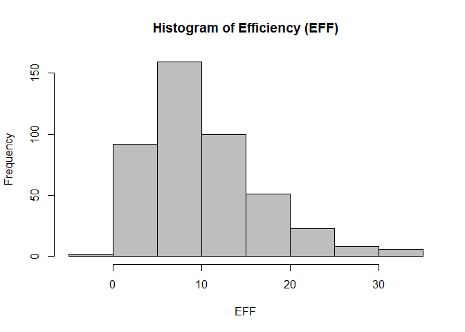

hw02-Pinshuo-Ye
================
Pinshuo Ye
9/27/2017

### Download the data

### 1) Create a data dictionary

### 2) Import the data in R

``` r
# Creating the data table and change the vector type
library(readr)
```

    ## Warning: package 'readr' was built under R version 3.4.2

``` r
dat <- data.frame(read.csv("C:\\Users\\pinshuo\\stat133\\stat133-hws-fall17\\hw02\\data\\nba2017-player-statistics.csv", colClasses = c(
  "Player" = "character",
  "Team" = "character",
  "Experience" = "character",
  "Salary" = "numeric") ))
str(dat)
```

    ## 'data.frame':    441 obs. of  24 variables:
    ##  $ Player      : chr  "Al Horford" "Amir Johnson" "Avery Bradley" "Demetrius Jackson" ...
    ##  $ Team        : chr  "BOS" "BOS" "BOS" "BOS" ...
    ##  $ Position    : Factor w/ 5 levels "C","PF","PG",..: 1 2 5 3 4 3 4 5 4 2 ...
    ##  $ Experience  : chr  "9" "11" "6" "R" ...
    ##  $ Salary      : num  26540100 12000000 8269663 1450000 1410598 ...
    ##  $ Rank        : int  4 6 5 15 11 1 3 13 8 10 ...
    ##  $ Age         : int  30 29 26 22 31 27 26 21 20 29 ...
    ##  $ GP          : int  68 80 55 5 47 76 72 29 78 78 ...
    ##  $ GS          : int  68 77 55 0 0 76 72 0 20 6 ...
    ##  $ MIN         : int  2193 1608 1835 17 538 2569 2335 220 1341 1232 ...
    ##  $ FGM         : int  379 213 359 3 95 682 333 25 192 114 ...
    ##  $ FGA         : int  801 370 775 4 232 1473 720 58 423 262 ...
    ##  $ Points3     : int  86 27 108 1 39 245 157 12 46 45 ...
    ##  $ Points3_atts: int  242 66 277 1 111 646 394 35 135 130 ...
    ##  $ Points2     : int  293 186 251 2 56 437 176 13 146 69 ...
    ##  $ Points2_atts: int  559 304 498 3 121 827 326 23 288 132 ...
    ##  $ FTM         : int  108 67 68 3 33 590 176 6 85 26 ...
    ##  $ FTA         : int  135 100 93 6 41 649 217 9 124 37 ...
    ##  $ OREB        : int  95 117 65 2 17 43 48 6 45 60 ...
    ##  $ DREB        : int  369 248 269 2 68 162 367 20 175 213 ...
    ##  $ AST         : int  337 140 121 3 33 449 155 4 64 71 ...
    ##  $ STL         : int  52 52 68 0 9 70 72 10 35 26 ...
    ##  $ BLK         : int  87 62 11 0 7 13 23 2 18 17 ...
    ##  $ TO          : int  116 77 88 0 25 210 79 4 68 39 ...

``` r
# Creating the data table and change the vector type
library(readr)
dat <- data.frame(read_csv("C:\\Users\\pinshuo\\stat133\\stat133-hws-fall17\\hw02\\data\\nba2017-player-statistics.csv", col_types = cols(
  Player = col_character(),
  Team = col_character(), 
  Experience = col_character(),
  Position = col_factor(c("C", "PF", "PG", "SG", "SF"), ordered = FALSE),
  Salary = col_double()
)))

str(dat)
```

    ## 'data.frame':    441 obs. of  24 variables:
    ##  $ Player      : chr  "Al Horford" "Amir Johnson" "Avery Bradley" "Demetrius Jackson" ...
    ##  $ Team        : chr  "BOS" "BOS" "BOS" "BOS" ...
    ##  $ Position    : Factor w/ 5 levels "C","PF","PG",..: 1 2 4 3 5 3 5 4 5 2 ...
    ##  $ Experience  : chr  "9" "11" "6" "R" ...
    ##  $ Salary      : num  26540100 12000000 8269663 1450000 1410598 ...
    ##  $ Rank        : int  4 6 5 15 11 1 3 13 8 10 ...
    ##  $ Age         : int  30 29 26 22 31 27 26 21 20 29 ...
    ##  $ GP          : int  68 80 55 5 47 76 72 29 78 78 ...
    ##  $ GS          : int  68 77 55 0 0 76 72 0 20 6 ...
    ##  $ MIN         : int  2193 1608 1835 17 538 2569 2335 220 1341 1232 ...
    ##  $ FGM         : int  379 213 359 3 95 682 333 25 192 114 ...
    ##  $ FGA         : int  801 370 775 4 232 1473 720 58 423 262 ...
    ##  $ Points3     : int  86 27 108 1 39 245 157 12 46 45 ...
    ##  $ Points3_atts: int  242 66 277 1 111 646 394 35 135 130 ...
    ##  $ Points2     : int  293 186 251 2 56 437 176 13 146 69 ...
    ##  $ Points2_atts: int  559 304 498 3 121 827 326 23 288 132 ...
    ##  $ FTM         : int  108 67 68 3 33 590 176 6 85 26 ...
    ##  $ FTA         : int  135 100 93 6 41 649 217 9 124 37 ...
    ##  $ OREB        : int  95 117 65 2 17 43 48 6 45 60 ...
    ##  $ DREB        : int  369 248 269 2 68 162 367 20 175 213 ...
    ##  $ AST         : int  337 140 121 3 33 449 155 4 64 71 ...
    ##  $ STL         : int  52 52 68 0 9 70 72 10 35 26 ...
    ##  $ BLK         : int  87 62 11 0 7 13 23 2 18 17 ...
    ##  $ TO          : int  116 77 88 0 25 210 79 4 68 39 ...

### 3) Right after importing the data

``` r
# Replacing the experience column
dat$Experience
```

    ##   [1] "9"  "11" "6"  "R"  "9"  "5"  "4"  "2"  "R"  "6"  "1"  "3"  "2"  "1" 
    ##  [15] "4"  "10" "12" "11" "5"  "1"  "5"  "12" "13" "R"  "8"  "13" "5"  "13"
    ##  [29] "15" "5"  "2"  "5"  "1"  "7"  "7"  "R"  "R"  "4"  "10" "2"  "1"  "5" 
    ##  [43] "R"  "6"  "7"  "2"  "4"  "7"  "1"  "R"  "8"  "8"  "6"  "9"  "5"  "3" 
    ##  [57] "R"  "R"  "3"  "R"  "3"  "12" "8"  "11" "4"  "12" "R"  "14" "3"  "10"
    ##  [71] "3"  "10" "3"  "3"  "6"  "2"  "17" "4"  "4"  "R"  "3"  "8"  "4"  "1" 
    ##  [85] "9"  "R"  "3"  "8"  "12" "11" "R"  "7"  "1"  "6"  "6"  "5"  "11" "1" 
    ##  [99] "6"  "1"  "9"  "8"  "1"  "1"  "1"  "R"  "13" "3"  "1"  "5"  "2"  "3" 
    ## [113] "2"  "R"  "10" "8"  "4"  "8"  "4"  "7"  "9"  "1"  "1"  "6"  "R"  "R" 
    ## [127] "2"  "13" "7"  "1"  "4"  "4"  "12" "1"  "1"  "R"  "6"  "5"  "3"  "5" 
    ## [141] "R"  "3"  "5"  "1"  "5"  "4"  "1"  "1"  "3"  "1"  "4"  "2"  "5"  "9" 
    ## [155] "11" "4"  "4"  "8"  "9"  "R"  "13" "R"  "8"  "7"  "9"  "3"  "1"  "4" 
    ## [169] "5"  "R"  "R"  "R"  "R"  "9"  "R"  "2"  "5"  "9"  "8"  "2"  "2"  "4" 
    ## [183] "8"  "7"  "R"  "1"  "5"  "R"  "R"  "4"  "R"  "R"  "7"  "1"  "8"  "R" 
    ## [197] "1"  "2"  "1"  "3"  "4"  "R"  "1"  "6"  "R"  "4"  "3"  "8"  "R"  "R" 
    ## [211] "6"  "2"  "2"  "2"  "4"  "10" "1"  "2"  "2"  "6"  "12" "R"  "13" "4" 
    ## [225] "3"  "2"  "8"  "9"  "1"  "5"  "13" "R"  "11" "7"  "13" "R"  "7"  "11"
    ## [239] "R"  "R"  "3"  "9"  "1"  "5"  "2"  "10" "14" "7"  "15" "15" "2"  "R" 
    ## [253] "2"  "8"  "R"  "7"  "R"  "11" "1"  "4"  "8"  "1"  "12" "R"  "7"  "4" 
    ## [267] "6"  "11" "R"  "11" "8"  "R"  "10" "16" "8"  "8"  "18" "11" "6"  "5" 
    ## [281] "13" "1"  "6"  "8"  "6"  "3"  "2"  "15" "R"  "1"  "2"  "3"  "5"  "1" 
    ## [295] "R"  "3"  "R"  "2"  "5"  "2"  "1"  "4"  "12" "5"  "8"  "R"  "3"  "7" 
    ## [309] "3"  "R"  "8"  "5"  "R"  "2"  "2"  "1"  "8"  "9"  "12" "3"  "18" "R" 
    ## [323] "R"  "15" "6"  "3"  "3"  "4"  "6"  "6"  "R"  "2"  "4"  "4"  "2"  "1" 
    ## [337] "2"  "R"  "7"  "7"  "1"  "2"  "R"  "12" "R"  "5"  "R"  "3"  "16" "1" 
    ## [351] "8"  "4"  "8"  "6"  "4"  "1"  "R"  "7"  "6"  "4"  "5"  "4"  "7"  "6" 
    ## [365] "R"  "3"  "2"  "R"  "3"  "12" "18" "R"  "2"  "4"  "10" "R"  "2"  "R" 
    ## [379] "1"  "3"  "7"  "R"  "8"  "9"  "3"  "R"  "7"  "6"  "R"  "8"  "2"  "R" 
    ## [393] "10" "R"  "7"  "7"  "1"  "2"  "2"  "8"  "6"  "3"  "7"  "1"  "R"  "1" 
    ## [407] "7"  "5"  "3"  "1"  "2"  "R"  "9"  "1"  "R"  "R"  "2"  "2"  "1"  "12"
    ## [421] "16" "9"  "2"  "4"  "6"  "2"  "1"  "3"  "5"  "R"  "1"  "R"  "2"  "6" 
    ## [435] "9"  "13" "R"  "11" "2"  "R"  "15"

``` r
dat$Experience[dat$Experience == "R"] <- "1"
dat$Experience <- as.integer(dat$Experience)
dat$Experience
```

    ##   [1]  9 11  6  1  9  5  4  2  1  6  1  3  2  1  4 10 12 11  5  1  5 12 13
    ##  [24]  1  8 13  5 13 15  5  2  5  1  7  7  1  1  4 10  2  1  5  1  6  7  2
    ##  [47]  4  7  1  1  8  8  6  9  5  3  1  1  3  1  3 12  8 11  4 12  1 14  3
    ##  [70] 10  3 10  3  3  6  2 17  4  4  1  3  8  4  1  9  1  3  8 12 11  1  7
    ##  [93]  1  6  6  5 11  1  6  1  9  8  1  1  1  1 13  3  1  5  2  3  2  1 10
    ## [116]  8  4  8  4  7  9  1  1  6  1  1  2 13  7  1  4  4 12  1  1  1  6  5
    ## [139]  3  5  1  3  5  1  5  4  1  1  3  1  4  2  5  9 11  4  4  8  9  1 13
    ## [162]  1  8  7  9  3  1  4  5  1  1  1  1  9  1  2  5  9  8  2  2  4  8  7
    ## [185]  1  1  5  1  1  4  1  1  7  1  8  1  1  2  1  3  4  1  1  6  1  4  3
    ## [208]  8  1  1  6  2  2  2  4 10  1  2  2  6 12  1 13  4  3  2  8  9  1  5
    ## [231] 13  1 11  7 13  1  7 11  1  1  3  9  1  5  2 10 14  7 15 15  2  1  2
    ## [254]  8  1  7  1 11  1  4  8  1 12  1  7  4  6 11  1 11  8  1 10 16  8  8
    ## [277] 18 11  6  5 13  1  6  8  6  3  2 15  1  1  2  3  5  1  1  3  1  2  5
    ## [300]  2  1  4 12  5  8  1  3  7  3  1  8  5  1  2  2  1  8  9 12  3 18  1
    ## [323]  1 15  6  3  3  4  6  6  1  2  4  4  2  1  2  1  7  7  1  2  1 12  1
    ## [346]  5  1  3 16  1  8  4  8  6  4  1  1  7  6  4  5  4  7  6  1  3  2  1
    ## [369]  3 12 18  1  2  4 10  1  2  1  1  3  7  1  8  9  3  1  7  6  1  8  2
    ## [392]  1 10  1  7  7  1  2  2  8  6  3  7  1  1  1  7  5  3  1  2  1  9  1
    ## [415]  1  1  2  2  1 12 16  9  2  4  6  2  1  3  5  1  1  1  2  6  9 13  1
    ## [438] 11  2  1 15

### 4) Performance of players

``` r
# calculating the EFF for every player
# first creating some related variables
missed_fg <- dat$FGA - dat$FGM
missed_ft <- dat$FTA - dat$FTM
PTS <- dat$FTM * 1 + dat$Points2 * 2 + dat$Points3 * 3
REB <- dat$OREB + dat$DREB
MPG <- dat$MIN/dat$GP

EFF <- (PTS + REB + dat$AST + dat$STL + dat$BLK - missed_fg - missed_ft - dat$TO) / dat$GP 
EFF
```

    ##   [1] 19.5147059 10.9000000 16.3454545  2.6000000  4.8085106 24.6842105
    ##   [7] 16.0694444  2.4137931  6.5897436  6.2564103  2.1600000 11.7466667
    ##  [13] 12.3797468  6.7837838  5.0000000  9.9324324  5.0000000  8.2916667
    ##  [19]  6.2000000 19.0000000  7.8815789  7.6341463  2.8333333  3.5476190
    ##  [25] 22.3666667 10.1714286 22.3888889 30.9729730  6.2531646 15.3846154
    ##  [31]  2.1111111 10.2625000  6.9629630 22.7162162  9.5000000  3.0270270
    ##  [37]  5.1296296 17.7125000 23.7333333  9.7894737  7.4868421  9.7916667
    ##  [43]  6.5090909  9.0769231 14.9565217 10.5769231 19.3116883  6.2608696
    ##  [49]  0.5000000  1.6315789  9.2580645  7.5945946 25.0256410 18.2926829
    ##  [55] 15.2368421 17.7000000  3.1666667  4.0000000  4.4561404  3.2631579
    ##  [61] 16.3164557 21.7432432 12.0769231  4.9411765 10.3013699  6.3392857
    ##  [67]  5.3698630  6.3333333  8.6285714 20.1304348  2.1875000 10.4677419
    ##  [73] 12.2278481 28.3750000 15.5432099 19.4313725  5.3648649 10.6034483
    ##  [79] 15.0689655 12.2400000  8.6973684  9.7500000  5.3857143  3.0975610
    ##  [85]  5.8421053  4.6842105  9.1750000  4.5692308  9.3333333  9.8421053
    ##  [91]  0.6086957 19.2439024  1.4848485  6.0816327  9.8333333  6.0000000
    ##  [97]  9.4054054 18.8271605 22.3866667  3.0344828 14.4189189  3.7777778
    ## [103]  8.5156250  2.9090909  8.3030303  5.3157895 16.4333333  4.0256410
    ## [109]  6.8412698 25.6052632  5.3000000  7.6444444 11.9571429  5.6818182
    ## [115] 13.6811594 13.1111111 13.3478261 19.2465753 25.3636364 15.1710526
    ## [121]  6.5909091 10.4339623 10.7222222  4.9558824  4.2000000  7.5384615
    ## [127] 14.2465753  3.1176471  8.5483871  8.5070423 21.2962963  7.8000000
    ## [133]  7.2820513  7.6285714  2.3589744  2.6842105 11.6419753 12.2666667
    ## [139] 12.0263158 12.5949367  0.0000000  5.4516129 12.5000000  5.0519481
    ## [145] 15.7926829  3.2926829  4.7692308  4.0769231 15.2419355 11.4266667
    ## [151] 10.7741935  4.7500000 20.8987342  9.7162162 14.1842105 14.3086420
    ## [157]  5.2307692 18.1558442  6.1400000  2.3333333 18.9324324  5.2777778
    ## [163] 11.8571429 16.3750000 13.0434783  8.1341463 18.6515152 11.3797468
    ## [169]  6.4782609  3.4285714  3.9687500  5.6617647  4.9230769  3.1666667
    ## [175] 12.6250000 13.2000000 10.8148148  5.1774194  6.8205128  1.6444444
    ## [181] 16.6463415 13.6911765  7.9275362  8.0277778  3.8000000  4.4307692
    ## [187] 20.2133333 -0.6000000  2.2631579 11.0833333 11.5000000 12.9135802
    ## [193]  8.3611111 11.7000000  9.0000000 20.6451613  9.6250000  8.8625000
    ## [199] 13.2807018 14.8656716  9.1176471 10.3888889 12.7407407  5.2500000
    ## [205]  5.8405797  3.8000000  8.6666667 18.8000000  9.2807018  7.2465753
    ## [211] 15.5555556  7.5000000  8.9062500  6.5000000  7.5625000  5.7246377
    ## [217] 11.8076923 11.4857143  9.8474576 15.0985915 12.7763158  2.6000000
    ## [223]  8.1176471 20.3157895  6.4285714  3.9615385  7.9610390 30.1935484
    ## [229]  4.4905660 17.9615385  9.6000000  4.5633803  6.7763158 25.2025316
    ## [235] 11.4428571  1.8333333  9.1176471 11.6962025  4.8805970  3.1842105
    ## [241] 11.0131579  2.8421053  6.2564103 25.2972973  6.3194444 18.6527778
    ## [247]  8.2608696  9.8125000 17.2031250 10.2539683  1.6400000  5.0000000
    ## [253] 17.7076923 12.5466667  1.0000000 32.3456790  0.9285714 12.0000000
    ## [259] 11.4310345 14.9402985 12.4583333  8.1298701 14.4750000 10.5000000
    ## [265]  2.1000000  9.8648649 23.9016393  6.6923077  1.6666667 24.7704918
    ## [271] 23.7654321  0.7142857 11.6410256  9.1463415  6.8875000 10.0487805
    ## [277]  3.4800000  8.0625000  4.3823529  6.0476190  5.6986301  5.8333333
    ## [283] 12.1200000 16.7142857 20.8356164  4.8627451  9.7195122  9.2051282
    ## [289]  2.6666667  3.1000000 10.3728814 24.8024691  7.8545455  5.9859155
    ## [295]  4.8823529 10.2911392  6.4691358  5.9545455 15.7361111  6.6025641
    ## [301] 11.5000000  2.9062500  3.1500000  2.3846154 33.8395062  3.6250000
    ## [307] 15.5625000  9.6956522 14.2686567  6.3750000  8.5357143  5.7352941
    ## [313]  2.8055556  8.7343750 13.2467532  5.4761905 21.1351351 20.9855072
    ## [319] 11.3380282  5.3134328  9.1506849  3.4242424  3.4545455 15.2602740
    ## [325] 12.6065574 10.2784810 19.7500000 24.5066667  8.0869565 10.4615385
    ## [331]  1.3428571 21.3000000 11.8961039  6.4459459  7.6216216  3.3846154
    ## [337]  4.1132075  1.9375000 17.9206349  7.2439024 10.0363636 14.9122807
    ## [343]  8.6707317 11.2266667  6.2903226 14.4426230  3.0909091 14.0370370
    ## [349]  3.2000000 25.1506849  1.1666667 14.0833333 15.8873239  7.8717949
    ## [355] 31.1600000  5.5000000  7.1764706  8.9545455 27.9411765  5.2352941
    ## [361]  9.3561644 11.9473684 17.7910448  6.9032258  5.3333333  8.9125000
    ## [367] 10.1692308  2.5454545 13.0000000  7.1692308 15.2777778  5.5061728
    ## [373]  9.3636364 16.3417722 11.4857143  5.5555556 14.1818182  3.6481481
    ## [379]  7.0410959 12.5428571 12.3150685 12.2500000  8.5692308  7.5245902
    ## [385]  6.3442623 13.2800000 13.6617647  9.6461538  8.0909091 10.4647887
    ## [391]  5.4210526  3.0454545 18.9666667 10.5151515 11.8405797 10.5714286
    ## [397] 10.4533333  4.1111111 16.8902439  5.0212766  4.3709677 16.3048780
    ## [403]  2.1428571 30.3292683  5.8205128  7.7846154  4.4615385 17.9466667
    ## [409]  8.2820513  5.5000000 15.8723404  8.8860759  6.5000000 13.9523810
    ## [415]  7.8500000  9.5000000 11.8048780 17.7567568 12.5079365  9.6785714
    ## [421]  1.4800000 10.4500000  9.0895522  7.4583333  9.4259259  7.6363636
    ## [427] 10.8936170 11.8051948  8.2962963  6.5000000 15.3333333  3.7441860
    ## [433]  0.5000000 20.8030303  8.6718750  5.5223881  9.4390244  2.2142857
    ## [439] 14.8030303  7.7377049 18.0425532

``` r
#showing the summary of the eff
summary(EFF)
```

    ##    Min. 1st Qu.  Median    Mean 3rd Qu.    Max. 
    ##  -0.600   5.452   9.090  10.137  13.247  33.840

``` r
#combine the dat to the eff as a new data frame
dat <- cbind(dat, EFF)

#creating the histogram
hist(EFF, main = "Histogram of Efficiency (EFF)", col = "grey")
```



``` r
# display the top 10 EFF
library(dplyr)
```

    ## Warning: package 'dplyr' was built under R version 3.4.2

    ## 
    ## Attaching package: 'dplyr'

    ## The following objects are masked from 'package:stats':
    ## 
    ##     filter, lag

    ## The following objects are masked from 'package:base':
    ## 
    ##     intersect, setdiff, setequal, union

``` r
top10eff <- dat[ , c("Player", "Team", "Salary", "EFF")]
top10eff <- arrange(top10eff, desc(EFF))
slice(top10eff, 1:10)
```

    ## # A tibble: 10 x 4
    ##                   Player  Team   Salary      EFF
    ##                    <chr> <chr>    <dbl>    <dbl>
    ##  1     Russell Westbrook   OKC 26540100 33.83951
    ##  2          James Harden   HOU 26540100 32.34568
    ##  3         Anthony Davis   NOP 22116750 31.16000
    ##  4          LeBron James   CLE 30963450 30.97297
    ##  5    Karl-Anthony Towns   MIN  5960160 30.32927
    ##  6          Kevin Durant   GSW 26540100 30.19355
    ##  7 Giannis Antetokounmpo   MIL  2995421 28.37500
    ##  8      DeMarcus Cousins   NOP 16957900 27.94118
    ##  9          Jimmy Butler   CHI 17552209 25.60526
    ## 10      Hassan Whiteside   MIA 22116750 25.36364

``` r
# Finding players having negative EFF
filter(dat[ , c("Player", "Team", "Salary", "EFF")], EFF < 0)
```

    ##            Player Team Salary  EFF
    ## 1 Patricio Garino  ORL  31969 -0.6

``` r
# Finding the coorelation coefficients between eff and other variables
cor(x = EFF, y = PTS)
```

    ## [1] 0.8588644

``` r
cor(x = EFF, y = REB)
```

    ## [1] 0.7634501

``` r
cor(x = EFF, y = dat$AST)
```

    ## [1] 0.6689232

``` r
cor(x = EFF, y = dat$STL)
```

    ## [1] 0.6957286

``` r
cor(x = EFF, y = dat$BLK)
```

    ## [1] 0.5679571

``` r
cor(x = EFF, y = -missed_fg)
```

    ## [1] -0.7722477

``` r
cor(x = EFF, y = -missed_ft)
```

    ## [1] -0.7271456

``` r
cor(x = EFF, y = -dat$TO)
```

    ## [1] -0.8003289

``` r
cor(x = EFF, y = dat$GP)
```

    ## [1] 0.4773648

``` r
#creating the barplot of the correlation coefficients
cc <- c(cor(x = EFF, y = PTS),
    cor(x = EFF, y = REB),
    cor(x = EFF, y = dat$AST),
    cor(x = EFF, y = dat$STL),
    cor(x = EFF, y = dat$BLK),
    cor(x = EFF, y = -missed_fg),
    cor(x = EFF, y = -missed_ft),
    cor(x = EFF, y = -dat$TO))

cc <- sort(cc, decreasing = TRUE)
cc
```

    ## [1]  0.8588644  0.7634501  0.6957286  0.6689232  0.5679571 -0.7271456
    ## [7] -0.7722477 -0.8003289

``` r
barplot(cc, 
        ylim = c(-1, 1), 
        main = "Correlations between Player stats and EEF", 
        names.arg = c("PTS", "REB", "STL", "AST", "BLK", "Missed_FT", "Missed_FG", "TO"),
        col = ifelse((cc > 0), "grey", "red"),
        cex.names = 0.71)
```


### 5) Effeciency and Salary

``` r
# making the scatterplot between eFf and salary, and their correlation coefficient
plot(EFF, dat$Salary, 
     col = 2, 
     ylab = "Salary", 
     main = "Scatterplot of EFF and Salary")
lines(lowess(EFF, dat$Salary), col = 3, lwd = 3)
```


``` r
cor(x = EFF, y = dat$Salary)
```

    ## [1] 0.655624

-   The two variables, EFF and salary, have a positive relation. Looking at the scatterplot, it is approximately. The lowess showed that the salary increasing slower in the left part than the right part. It means that the the increasing rate of salary is higher when the player has high EFF.

``` r
# Taking players that MPG is higher than 20 minutes
library(dplyr)
dat <- cbind(dat, MPG)
player2 <- filter(dat, dat$MPG > 20)
```

``` r
# creating the scatterplot and the lowess line
plot(player2$EFF, player2$Salary, 
     col = 2,
     xlab = "EFF",
     ylab = "Salary", 
     main = "Scatterplot of EFF and Salary of Over 20 minutes")
lines(lowess(player2$EFF, player2$Salary), col = 4, lwd = 3)
```


``` r
cor(player2$EFF, player2$Salary)
```

    ## [1] 0.5367224

-   For the more established players the lowess line is higher than all the player. It shows a more stable increasing comparing to the previous one.

### 6) Comments and Reflections

-   The first part is hard, since I had some difficulty about writing the data dictionary and reading table.
-   The esay things is creating the plots.
-   I need some help from my classmates to solve some problems.
-   I took several hours to do the homework.
-   The first two questions is the most time consuming part.
-   I still need more research to get clear about the relationship between variables and salary.
-   I feel very exited to starting the data analysis about the NBA players.
