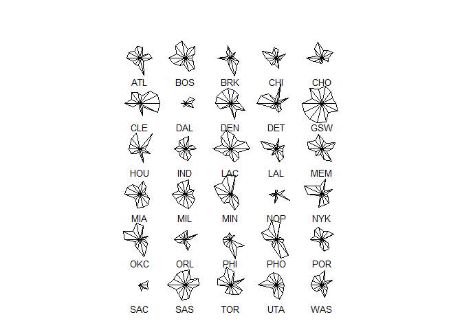
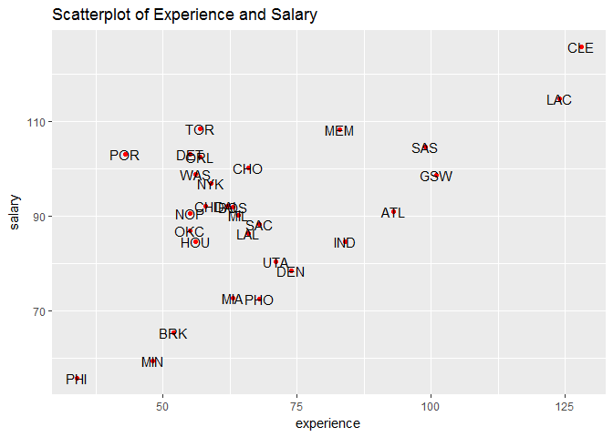
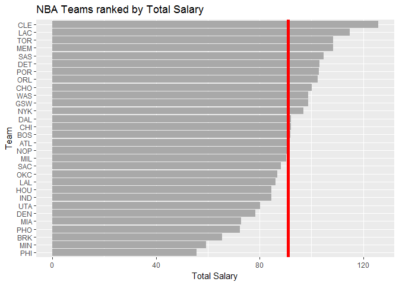
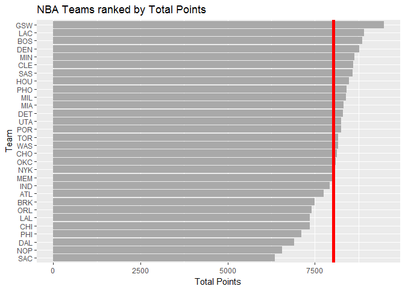
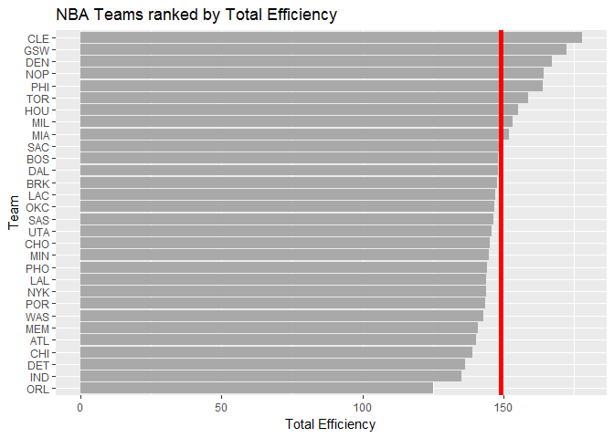
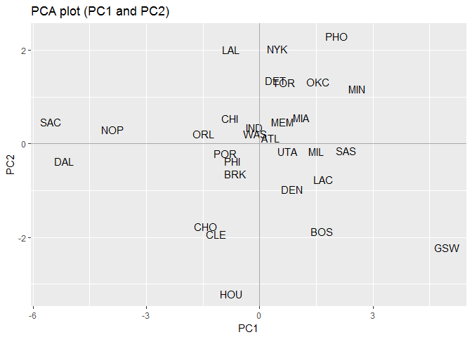
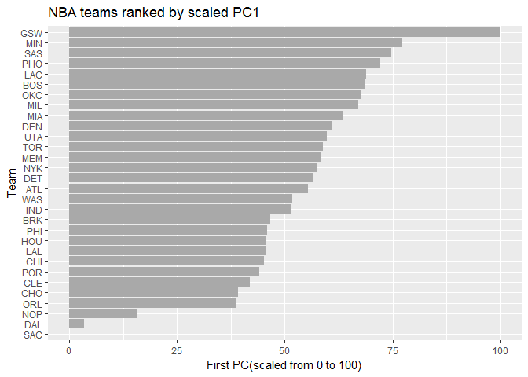

hw03, stat 133
================
Pinshuo Ye
10/11/2017

HW 03 - Ranking NBA Teams
-------------------------

### Data Preparation

``` r
# download RData file into working directory
github <- "https://github.com/ucb-stat133/stat133-fall-2017/raw/master/"
csv <- "data/nba2017-roster.csv"
download.file(url = paste0(github, csv), destfile = 'nba2017-roster.csv')
```

``` r
# download RData file into working directory
github <- "https://github.com/ucb-stat133/stat133-fall-2017/raw/master/"
csv <- "data/nba2017-stats.csv"
download.file(url = paste0(github, csv), destfile = 'nba2017-stats.csv')
```

``` r
# Creating the data table and change the vector type
library(readr)
```

    ## Warning: package 'readr' was built under R version 3.4.2

``` r
dat1 <- data.frame(
  read_csv(
    "C:\\Users\\pinshuo\\stat133\\stat133-hws-fall17\\hw03\\data\\nba2017-roster.csv",
    col_types = cols(
      player = col_character(),
      team = col_factor(c("ATL", "BOS", "BRK", "CHI", "CHO", "CLE", "DAL", 
                          "DEN", "DET", "GSW", "HOU", "IND", "LAC", "LAL",
                          "MEM", "MIA", "MIL", "MIN", "NOP", "NYK", "OKC",
                          "ORL", "PHI", "PHO", "POR", "SAC", "SAS", "TOR",
                          "UTA", "WAS"), ordered = FALSE), 
      experience = col_integer(),
      position = col_factor(c("C", "PF", "PG", "SG", "SF"), ordered = FALSE),
      salary = col_double()
    )
    ))
```

``` r
# Creating the data table and change the vector type
library(readr)
dat2 <- data.frame(
  read_csv(
    "C:\\Users\\pinshuo\\stat133\\stat133-hws-fall17\\hw03\\data\\nba2017-stats.csv",
    col_types = cols(
      player = col_character(),
      field_goals_perc = col_double(),
      points3_perc = col_double(),
      points2_perc = col_double(),
      points1_perc = col_double()
    )
  ))
```

``` r
# adding new variables to the data frame using mutate
library(dplyr)
```

    ## Warning: package 'dplyr' was built under R version 3.4.2

    ## 
    ## Attaching package: 'dplyr'

    ## The following objects are masked from 'package:stats':
    ## 
    ##     filter, lag

    ## The following objects are masked from 'package:base':
    ## 
    ##     intersect, setdiff, setequal, union

``` r
missed_fg <- dat2$field_goals_atts - dat2$field_goals_made
missed_ft <- dat2$points1_atts - dat2$points1_made
points <- dat2$points3_made * 3 + dat2$points2_made * 2 + dat2$points1_made
rebounds = dat2$off_rebounds + dat2$def_rebounds
efficiency <- (points + rebounds + dat2$assists 
               + dat2$steals + dat2$blocks 
               - missed_fg - missed_ft - dat2$turnovers) / dat2$games_played
efficiency <- as.numeric(efficiency, nsmall = 2)
```

``` r
# Output the structure of the data efficiency
sink(file = 
       'C:/Users/pinshuo/stat133/stat133-hws-fall17/hw03/output/efficiency-summary.txt')
summary(efficiency)
```

    ##    Min. 1st Qu.  Median    Mean 3rd Qu.    Max. 
    ##  -0.600   5.452   9.090  10.137  13.247  33.840

``` r
sink()
```

``` r
# using mutate to combine the vectors and the data frame
dat2 <- dat2 %>%
  mutate(missed_fg, missed_ft, points, rebounds, efficiency)

# using merge to combine the two data frame
dat <- merge(dat1, dat2)
```

``` r
# Grouping by team and creating the summary
teams <- 
  dat %>%
  group_by(team) %>%
  summarise(
    experience = round(sum(experience), 2),
    salary = round(sum(salary/1000000), 2),
    points3 = sum(points3_made),
    points2 = sum(points2_made),
    free_throws = sum(points1_made),
    points = sum(points),
    off_rebounds = sum(off_rebounds),
    def_rebounds = sum(def_rebounds),
    assists = sum(assists),
    steals = sum(steals),
    blocks = sum(blocks),
    turnovers = sum(turnovers),
    fouls = sum(fouls),
    efficiency = sum(efficiency)
  )

summary(teams)
```

    ##       team      experience         salary          points3      
    ##  ATL    : 1   Min.   : 34.00   Min.   : 55.78   Min.   : 513.0  
    ##  BOS    : 1   1st Qu.: 56.00   1st Qu.: 84.59   1st Qu.: 617.0  
    ##  BRK    : 1   Median : 63.00   Median : 91.41   Median : 704.0  
    ##  CHI    : 1   Mean   : 68.73   Mean   : 90.95   Mean   : 730.7  
    ##  CHO    : 1   3rd Qu.: 73.25   3rd Qu.:101.87   3rd Qu.: 805.8  
    ##  CLE    : 1   Max.   :128.00   Max.   :125.79   Max.   :1141.0  
    ##  (Other):24                                                     
    ##     points2      free_throws       points      off_rebounds  
    ##  Min.   :1769   Min.   : 998   Min.   :6348   Min.   :524.0  
    ##  1st Qu.:2115   1st Qu.:1238   1st Qu.:7561   1st Qu.:699.2  
    ##  Median :2252   Median :1384   Median :8164   Median :762.5  
    ##  Mean   :2242   Mean   :1359   Mean   :8035   Mean   :768.7  
    ##  3rd Qu.:2413   3rd Qu.:1492   3rd Qu.:8452   3rd Qu.:865.8  
    ##  Max.   :2638   Max.   :1605   Max.   :9473   Max.   :961.0  
    ##                                                              
    ##   def_rebounds     assists         steals          blocks     
    ##  Min.   :1878   Min.   :1291   Min.   :475.0   Min.   :234.0  
    ##  1st Qu.:2435   1st Qu.:1546   1st Qu.:544.8   1st Qu.:311.0  
    ##  Median :2536   Median :1738   Median :590.0   Median :351.5  
    ##  Mean   :2524   Mean   :1732   Mean   :583.3   Mean   :360.3  
    ##  3rd Qu.:2644   3rd Qu.:1858   3rd Qu.:612.0   3rd Qu.:389.5  
    ##  Max.   :2854   Max.   :2475   Max.   :779.0   Max.   :551.0  
    ##                                                               
    ##    turnovers          fouls        efficiency   
    ##  Min.   : 703.0   Min.   :1164   Min.   :125.1  
    ##  1st Qu.: 973.5   1st Qu.:1355   1st Qu.:143.8  
    ##  Median :1021.5   Median :1519   Median :146.7  
    ##  Mean   :1013.5   Mean   :1496   Mean   :149.0  
    ##  3rd Qu.:1087.2   3rd Qu.:1599   3rd Qu.:152.9  
    ##  Max.   :1184.0   Max.   :1886   Max.   :177.9  
    ## 

``` r
#use sink to output the new table
sink(file = "C:/Users/pinshuo/stat133/stat133-hws-fall17/hw03/data/teams-summary.txt")
summary(teams)
```

    ##       team      experience         salary          points3      
    ##  ATL    : 1   Min.   : 34.00   Min.   : 55.78   Min.   : 513.0  
    ##  BOS    : 1   1st Qu.: 56.00   1st Qu.: 84.59   1st Qu.: 617.0  
    ##  BRK    : 1   Median : 63.00   Median : 91.41   Median : 704.0  
    ##  CHI    : 1   Mean   : 68.73   Mean   : 90.95   Mean   : 730.7  
    ##  CHO    : 1   3rd Qu.: 73.25   3rd Qu.:101.87   3rd Qu.: 805.8  
    ##  CLE    : 1   Max.   :128.00   Max.   :125.79   Max.   :1141.0  
    ##  (Other):24                                                     
    ##     points2      free_throws       points      off_rebounds  
    ##  Min.   :1769   Min.   : 998   Min.   :6348   Min.   :524.0  
    ##  1st Qu.:2115   1st Qu.:1238   1st Qu.:7561   1st Qu.:699.2  
    ##  Median :2252   Median :1384   Median :8164   Median :762.5  
    ##  Mean   :2242   Mean   :1359   Mean   :8035   Mean   :768.7  
    ##  3rd Qu.:2413   3rd Qu.:1492   3rd Qu.:8452   3rd Qu.:865.8  
    ##  Max.   :2638   Max.   :1605   Max.   :9473   Max.   :961.0  
    ##                                                              
    ##   def_rebounds     assists         steals          blocks     
    ##  Min.   :1878   Min.   :1291   Min.   :475.0   Min.   :234.0  
    ##  1st Qu.:2435   1st Qu.:1546   1st Qu.:544.8   1st Qu.:311.0  
    ##  Median :2536   Median :1738   Median :590.0   Median :351.5  
    ##  Mean   :2524   Mean   :1732   Mean   :583.3   Mean   :360.3  
    ##  3rd Qu.:2644   3rd Qu.:1858   3rd Qu.:612.0   3rd Qu.:389.5  
    ##  Max.   :2854   Max.   :2475   Max.   :779.0   Max.   :551.0  
    ##                                                               
    ##    turnovers          fouls        efficiency   
    ##  Min.   : 703.0   Min.   :1164   Min.   :125.1  
    ##  1st Qu.: 973.5   1st Qu.:1355   1st Qu.:143.8  
    ##  Median :1021.5   Median :1519   Median :146.7  
    ##  Mean   :1013.5   Mean   :1496   Mean   :149.0  
    ##  3rd Qu.:1087.2   3rd Qu.:1599   3rd Qu.:152.9  
    ##  Max.   :1184.0   Max.   :1886   Max.   :177.9  
    ## 

``` r
sink()
```

``` r
# create the csv file
write.csv(teams,
          file = 
            "C:/Users/pinshuo/stat133/stat133-hws-fall17/hw03/data/nba2017-teams.csv")

teams$team <- as.character(teams$team)
#creating the star plot and output the file
stars(teams[ , -1], labels = teams$team) 
```



``` r
pdf(file = "C:/Users/pinshuo/stat133/stat133-hws-fall17/hw03/images/teams_star_plot.pdf")
stars(teams[ , -1], labels = teams$team) 
dev.off()
```

    ## png 
    ##   2

``` r
# creating a ggplot to pdf
library(ggplot2)
ggplot(teams, aes(x = experience, y = salary)) +
  geom_point(col = "red") +
  geom_text(label = teams$team)+
  ggtitle("Scatterplot of Experience and Salary")
```



``` r
# Creating pdf version of the ggplot of experience and salary
pdf(file =
      "C:/Users/pinshuo/stat133/stat133-hws-fall17/hw03/images/experience_salary.pdf")
ggplot(teams, aes(x = experience, y = salary)) +
  geom_point(col = "red") +
  geom_text(label = teams$team)+
  ggtitle("Scatterplot of Experience and Salary")
dev.off()
```

    ## png 
    ##   2

### Ranking Teams

``` r
teams <- arrange(teams, desc(salary))
# creating a horizontal bar plot
ggplot(data = teams, aes(x = reorder(team, salary), y = salary)) +
  geom_bar(stat = 'identity', fill = "dark grey") +
  geom_hline(yintercept = mean(teams$salary), lwd = 2, col = 2) +
  coord_flip()+
  labs(title = "NBA Teams ranked by Total Salary", 
       y = "Total Salary", x = "Team")
```



``` r
# creating a horizontal bar plot
ggplot(data = teams, aes(x = reorder(team, points), y = points)) +
  geom_bar(stat = 'identity', fill = "dark grey") +
  geom_hline(yintercept = mean(teams$points), lwd = 2, col = 2) +
  coord_flip()+
  labs(title = "NBA Teams ranked by Total Points", 
       y = "Total Points", x = "Team")
```



``` r
# creating a horizontal bar plot using the efficiency
ggplot(data = teams, aes(x = reorder(team, efficiency), y = efficiency)) +
  geom_bar(stat = 'identity', fill = "dark grey") +
  geom_hline(yintercept = mean(teams$efficiency), lwd = 2, col = 2) +
  coord_flip() +
  labs(title = "NBA Teams ranked by Total Efficiency", 
       y = "Total Efficiency", x = "Team")
```



-   The ranking of the salary is somehow related to the efficiency.
-   The Cavaliers is rank number one on both the ranking chart, so in these two comparasions, CLE is the first in the league. And it is obvious that the total salary of the team is related to the quality of the players, as well as the total team efficiency.
-   And the relationship between the salary and the points is also relavant.

``` r
# Creating the new data frame of required vectors
teams1 <- select(teams, points3, points2, 
                 free_throws, off_rebounds, def_rebounds, 
                 assists, steals, blocks, turnovers, fouls)
pca <- prcomp(teams1, scale. = TRUE)
names(pca)
```

    ## [1] "sdev"     "rotation" "center"   "scale"    "x"

``` r
# showing the eigenvalue
eigs <- data.frame(
  eigenvalue = round(pca$sdev^2, 4),
  proportion = round(pca$sdev^2/sum(pca$sdev^2), 4),
  cumprop = round(cumsum(pca$sdev^2 / sum(pca$sdev^2)), 4)
)
eigs
```

    ##    eigenvalue proportion cumprop
    ## 1      4.6959     0.4696  0.4696
    ## 2      1.7020     0.1702  0.6398
    ## 3      0.9795     0.0980  0.7377
    ## 4      0.7717     0.0772  0.8149
    ## 5      0.5341     0.0534  0.8683
    ## 6      0.4780     0.0478  0.9161
    ## 7      0.3822     0.0382  0.9543
    ## 8      0.2603     0.0260  0.9804
    ## 9      0.1336     0.0134  0.9937
    ## 10     0.0627     0.0063  1.0000

``` r
# Creating the ggtext plot of the pc values of the teams
pcvalue <- data.frame(teams$team, pca$x)
ggplot(data = pcvalue, aes(x = -PC1, y = PC2)) +
  geom_text(aes(label = pcvalue$team)) +
  geom_hline(yintercept = 0, col = "dark grey")+
  geom_vline(xintercept = 0, col = "dark grey")+
  labs(x = "PC1")+
  ggtitle("PCA plot (PC1 and PC2)")
```



``` r
# Creating the index function
pcscale <- function(x) {
  100 * (x - min(x))/(max(x) - min(x))
}

# rewrite the scaled vector
teams <- mutate(teams, PC1 = -pcvalue$PC1, PC2 = pcvalue$PC2)
teams$PC1 <- pcscale(teams$PC1)
teams
```

    ## # A tibble: 30 x 17
    ##     team experience salary points3 points2 free_throws points off_rebounds
    ##    <chr>      <dbl>  <dbl>   <int>   <int>       <int>  <dbl>        <int>
    ##  1   CLE        128 125.79    1012    2107        1355   8605          727
    ##  2   LAC        124 114.78     841    2401        1586   8911          740
    ##  3   TOR         57 108.46     626    2359        1570   8166          848
    ##  4   MEM         83 108.34     750    2140        1465   7995          866
    ##  5   SAS         99 104.69     743    2459        1431   8578          821
    ##  6   DET         55 103.07     631    2638        1140   8309          908
    ##  7   POR         43 103.03     852    2156        1386   8254          710
    ##  8   ORL         57 102.41     614    2168        1230   7408          699
    ##  9   CHO         66 100.25     808    2102        1499   8127          634
    ## 10   WAS         56  98.78     671    2417        1316   8163          748
    ## # ... with 20 more rows, and 9 more variables: def_rebounds <int>,
    ## #   assists <int>, steals <int>, blocks <int>, turnovers <int>,
    ## #   fouls <int>, efficiency <dbl>, PC1 <dbl>, PC2 <dbl>

``` r
# Creating the ggplot barplot of the pc values
ggplot(teams, aes(x = reorder(team, PC1), y = PC1)) +
  geom_bar(stat = "identity", fill = "dark grey") +
  coord_flip()+
  labs(x = "Team", y = "First PC(scaled from 0 to 100)", 
       title = "NBA teams ranked by scaled PC1")
```



-   The scaled pc1 is to show the relative relationship between the teams.
-   The largest is 100, and the smallest is 0, so the scaled barplot is more clear to show the rank.
-   According to this rank, GSW is no.1.

### Reflection:

-   It is not the first time that I deal with this file stuctures, and I feel good about it.
-   The relative path is quite useful and organized, avoiding lot of mess.
-   Writing R script is not as the rmd file, there is no extra informations, and no code chunks to seperate the codes, so it is very important to organized and write good comments.
-   The homework is not so hard, but there is some parameters that I am not familiar with, so it took me longer to find how to use the parameters.
-   I asked several classmates about the parameters.
-   Several hours to complete it.
-   The homework is interesting, but finding the parameters is time consuming and not fun.
