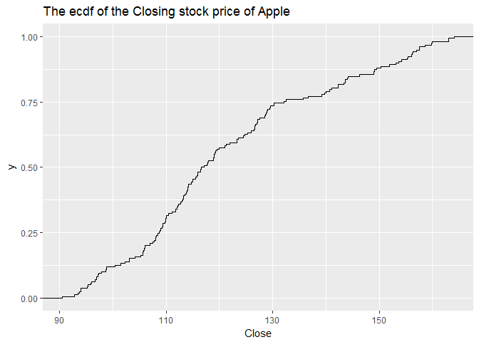
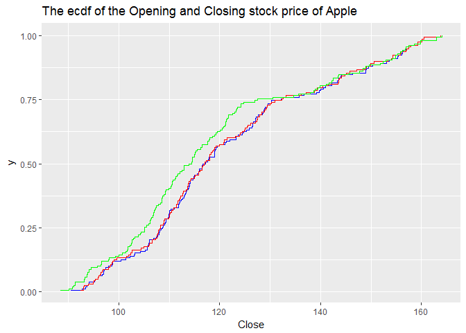
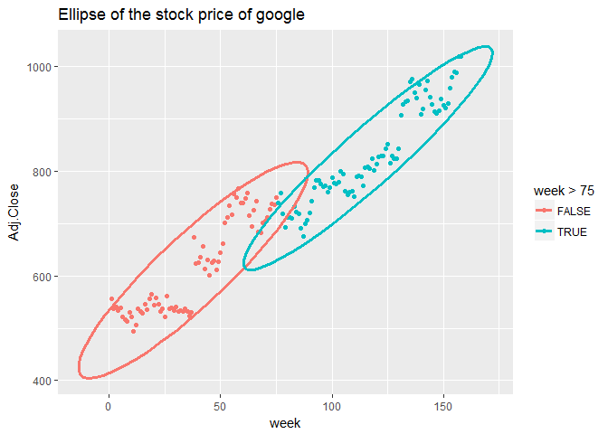
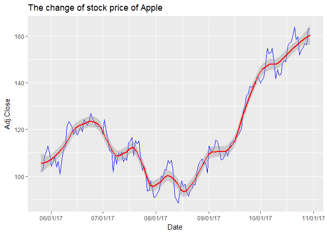
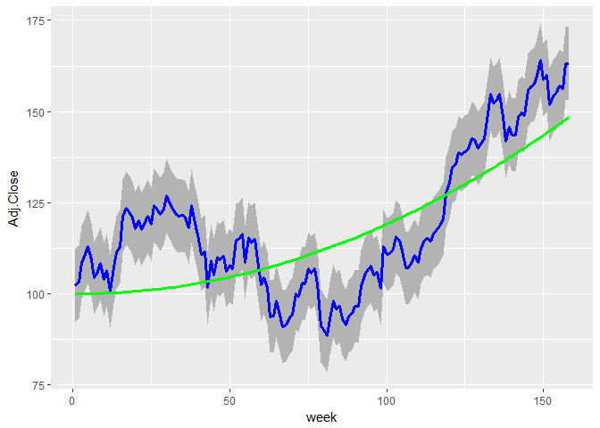
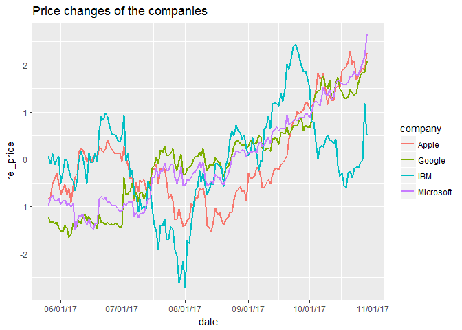
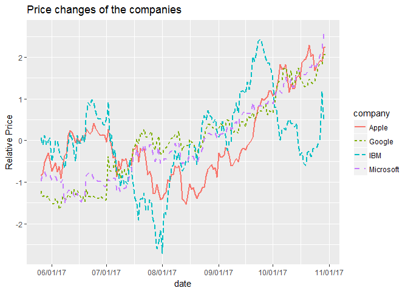
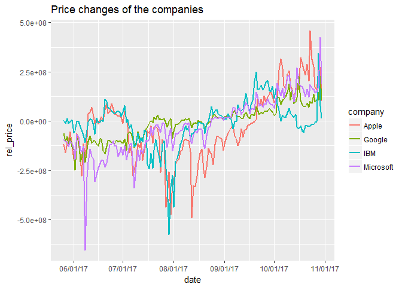
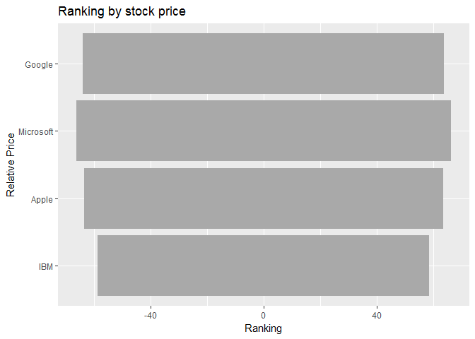

Post01:
================
Pinshuo Ye
10/29/2017

Post 01: The extension and application of ggplot
================================================

#### -The comparasion of the stock price of the companies

Introduction
------------

The package of ggplot could construct a lot of elegant and practical graphs, which is quite popular among R users. Adding multiple layers in the plot is very easy, so it is a powerful tool for data visualization.

So using ggplot, we can make comparaions of the changes of the stock market of some technology companies, visualize the data as graphs.

First thing we need to do is to download and **load the data**:

``` r
apple <- data.frame(read.csv("C:\\Users\\pinshuo\\stat133\\stat133-hws-fall17\\post01\\data\\AAPL.csv"))
google <- data.frame(read.csv("C:\\Users\\pinshuo\\stat133\\stat133-hws-fall17\\post01\\data\\GOOG.csv"))
ibm <- data.frame(read.csv("C:\\Users\\pinshuo\\stat133\\stat133-hws-fall17\\post01\\data\\IBM.csv"))
msft <- data.frame(read.csv("C:\\Users\\pinshuo\\stat133\\stat133-hws-fall17\\post01\\data\\MSFT.csv"))
```

There are many different companies in the stock market of **Nasdaq**, so we can choose the companies that are the most representitive. So here are the four large technology companies: Apple, Google, IBM and Microsoft.

Then we can take a peak of the data frames:

``` r
# adding week number
library(dplyr)
```

    ## Warning: package 'dplyr' was built under R version 3.4.2

    ## 
    ## Attaching package: 'dplyr'

    ## The following objects are masked from 'package:stats':
    ## 
    ##     filter, lag

    ## The following objects are masked from 'package:base':
    ## 
    ##     intersect, setdiff, setequal, union

``` r
week <- 1:158
apple <- data.frame(week, apple)
google <- data.frame(week, google)
ibm <- data.frame(week, ibm)
msft <- data.frame(week, msft)

head(apple)
```

    ##   week       Date   Open   High    Low  Close Adj.Close    Volume
    ## 1    1 2014-10-27 106.65 108.04 105.90 108.00  102.1599 137982000
    ## 2    2 2014-11-03 108.22 110.30 107.72 109.01  103.1153 199952900
    ## 3    3 2014-11-10 109.02 114.19 108.40 114.18  108.4741 205166700
    ## 4    4 2014-11-17 114.27 117.57 113.30 116.47  110.6497 233414700
    ## 5    5 2014-11-24 116.85 119.75 116.62 118.93  112.9867 181873900
    ## 6    6 2014-12-01 118.81 119.25 111.27 115.00  109.2531 266589700

``` r
head(google)
```

    ##   week       Date     Open     High      Low    Close Adj.Close  Volume
    ## 1    1 2014-10-27 546.9924 556.5100 540.5378 556.0227  556.0227 5275600
    ## 2    2 2014-11-03 552.4623 554.8491 535.7243 538.0515  538.0515 7646500
    ## 3    3 2014-11-10 538.4990 548.9218 538.0615 541.4230  541.4230 5874600
    ## 4    4 2014-11-17 540.6074 540.8163 527.1813 534.5607  534.5607 8892600
    ## 5    5 2014-11-24 534.7099 541.0052 532.6910 538.8670  538.8670 6184400
    ## 6    6 2014-12-01 535.9531 538.4493 521.4130 522.3876  522.3876 8901800

``` r
head(ibm)
```

    ##   week       Date   Open   High    Low  Close Adj.Close   Volume
    ## 1    1 2014-10-27 164.33 165.59 162.76 164.40  148.0934 14453300
    ## 2    2 2014-11-03 164.25 164.54 160.05 162.07  145.9945 20602200
    ## 3    3 2014-11-10 161.90 164.49 161.61 164.16  148.8893 20088900
    ## 4    4 2014-11-17 164.16 164.97 159.80 160.92  145.9507 22271600
    ## 5    5 2014-11-24 161.54 163.86 161.01 162.17  147.0845 17052900
    ## 6    6 2014-12-01 161.64 164.52 161.35 163.27  148.0821 20936100

``` r
head(msft)
```

    ##   week       Date  Open  High   Low Close Adj.Close    Volume
    ## 1    1 2014-10-27 46.44 46.97 45.77 46.95  43.45788  96199700
    ## 2    2 2014-11-03 46.89 48.92 46.73 48.68  45.05920 128149200
    ## 3    3 2014-11-10 48.65 50.05 48.52 49.58  45.89226 137829500
    ## 4    4 2014-11-17 49.41 49.71 47.57 47.98  44.41126 144887000
    ## 5    5 2014-11-24 47.99 48.20 47.28 47.81  44.53303 112140200
    ## 6    6 2014-12-01 47.88 49.06 47.71 48.42  45.10122 138133700

We can see that there are 7 different variables, and each company has different volumes of the stock.

Motivations
-----------

Given the data of the stock market price, we can use ggpolt to show the changes of the stock market. Since the stock market connot be shown just as a simple plot or just the smooth line, we are trying to create a polygon that shows the path discretely.

Here is a cheatsheet for ggplot, and we look at the functions to see if there is anything that is useful to visualize the data of stock prices.


There is a column which has a title ***stat***, and it has some functions that we haven\`t learned before. So it may useful to create a step plot.

Graphing and Comparing
----------------------

### stat

In ggplot2, the function **stat\_ecdf** is a useful function.

``` r
# Creating a ecdf for the Closing stock price of company apple
library(ggplot2)
ggplot(apple, aes(x = Close)) + 
  stat_ecdf(geom = "step") +
  ggtitle("The ecdf of the Closing stock price of Apple")
```



Or we can use the same ecdf, but hide the the infinity part, and adding multiple ecdfs in the same graph:

``` r
# Creating a ecdf for the Closing stock price of company apple
# Adding multiple ecdfs
library(ggplot2)
ggplot(apple) + 
  stat_ecdf(aes(x = Close), geom = "step", pad = FALSE, color = "blue") +
  stat_ecdf(aes(x = Open), geom = "step", pad = FALSE, color = "red") +
  stat_ecdf(aes(x = Adj.Close), geom = "step", pad = FALSE, color = "green") +
  ggtitle("The ecdf of the Opening and Closing stock price of Apple")
```



The ecdf shows the rate of the growing stock price, and if the graph is going up means the price is rising.

The ellipse graph can show the distribution of the data, and circle it using ellipse.

``` r
# using ellipse
ggplot(google, aes(x = week, y = Adj.Close, color = week > 75)) +
  geom_point() +
  stat_ellipse(lwd = 1.2) +
  ggtitle("Ellipse of the stock price of google")
```



The graphs and plots can show the part of the tendency of the stock price. And if we know the graph is vary in diffrerent intervals, we can seperate them using the ellipse.

``` r
# Adding date to the plot to show the stock price
days <- Sys.Date() - 157:0
apple <- data.frame(
  Date = days,
  apple
)

# Creating the line, and also create a smooth line
ggplot(apple, aes(Date, Adj.Close)) +
  geom_line(color = "blue") +
  scale_x_date(date_labels = "%D") +
  stat_smooth(color='red', span=0.2) +
  ggtitle("The change of stock price of Apple")
```

    ## `geom_smooth()` using method = 'loess'



This kind of graph is what we need, using the *geom\_line* and create them with the date, to show the tendency of the stock price, and we can use the graph to compare multiple companies. However, the price of the stock among the companies is also vary, so we need to modify the data first then do the comparasion.

There is also a useful function that could compute the function in x value, which is the *stat\_function*, it can simulate the data to a similar function. And we can use the function *geom\_ribbon* to show the range of the line, but compared to the lowess line, it is not continuous.

``` r
# Creating a function first
func <- function(x) {0.002*x^2 - 0.01*x + 100}

# applying the function to the graph
# Adding the function *geom_ribbon* into the graph
ggplot(apple, aes(week, Adj.Close)) + 
  geom_ribbon(aes(ymin = Adj.Close - 10, ymax = Adj.Close + 10), fill = "grey70") +
  geom_line(color = "blue", lwd = 1.1) +
  stat_function(fun = func, color = "green", lwd = 1.1)
```



It is important to make the ribbon first and then create the line, because the if the line is created first, the graph of ribbon will cover the line and we cannot see anything about the line.

We can use the *scale\_x\_date* and the *geom\_line* to create the tendency of the price of four companies.

``` r
# creating a new data frame
apple_price <- (apple$Adj.Close - mean(apple$Adj.Close))/sd(apple$Adj.Close)
google_price <- (google$Adj.Close - mean(google$Adj.Close))/sd(google$Adj.Close)
msft_price <- (msft$Adj.Close - mean(msft$Adj.Close))/sd(msft$Adj.Close)
ibm_price <- (ibm$Adj.Close - mean(ibm$Adj.Close))/sd(ibm$Adj.Close)

dat <- data.frame(
  date = rep(apple$Date, 4),
  company = c(rep("Apple", 158), rep("Google", 158), rep("Microsoft", 158), rep("IBM", 158)),
  rel_price = c(apple_price, google_price, msft_price, ibm_price)
)
dat$company <- as.factor(dat$company)

# Creating the line
ggplot(dat, aes(date, rel_price, color = company)) +
  geom_line(lwd = 1.01) +
  scale_x_date(date_labels = "%D") +
  ggtitle("Price changes of the companies")
```



In this graph, we can see the changes of the stock price of four technology companies. Using the relative price, we can put the graphs all together and compare the data in one graph.

Using the function *line\_type*, we can change the type of the line since the lines are too messy.

``` r
# Creating the line
ggplot(dat, aes(date, rel_price, color = company)) +
  geom_line(aes(linetype = company), lwd = 1.005) +
  scale_x_date(date_labels = "%D") +
  ggtitle("Price changes of the companies") +
  ylab("Relative Price")
```



-   This graph has been modified by the average and standard deviation.
-   The horizontal axis is shown by date.
-   We can see the tendency of the graph, where the company IBM has the largest variance in the measure of the stock price.
-   Microsoft and google company grow in a stable rate, and there is no obvious decreasing.

### Ranking

To make the rank of the companies, we cannot just look at the stock price since it cannot provide us complete situation of the companies. The stock price changes also involves the volume of the stock, because the volume of the stock multiplied by the stock price could get the total money that the companied gained from the stock market.

``` r
# recreating the data frame 
dat1 <- data.frame(
  date = rep(apple$Date, 4),
  company = c(rep("Apple", 158), rep("Google", 158), rep("Microsoft", 158), rep("IBM", 158)),
  rel_price = c(apple_price * apple$Volume, 
                google_price * google$Volume * 10, 
                msft_price * msft$Volume, 
                ibm_price * ibm$Volume * 5)
)
dat$company <- as.factor(dat$company)

# Creating the plot
ggplot(dat1, aes(date, rel_price, color = company)) +
  geom_line(lwd = 1.01) +
  scale_x_date(date_labels = "%D") +
  ggtitle("Price changes of the companies")
```



``` r
ggplot(data = dat, aes(x = reorder(company, rel_price), y = rel_price)) +
  geom_bar(stat = 'identity', fill = "dark grey") +
  coord_flip() +
  labs(title = "Ranking by stock price", x = "Relative Price", y = "Ranking")
```



Conclusion
----------

-   Using the extension of the package *ggplot*, we can putting the data of the stock price together and making analysis.
-   Some of the plots and techniques are not covered in the class, and they are useful to deal with the data.
-   We can try different approaches to make analysis on the data, and we can choose the best way to visualize the data.
-   When the variance of the data is too large to conclude, we can make modification on the data so that we can combine the stock price of the several companies.
-   It is also very important to seperate the lines with color.
-   Company ranking is based on both the graphs and data.

References
----------

-   Finance data: [www.finance.yahoo.com](www.finance.yahoo.com)
-   Functions: <http://ggplot2.tidyverse.org/reference/>
-   Cheatsheet: <https://www.rstudio.com/wp-content/uploads/2015/03/ggplot2-cheatsheet.pdf>
-   <http://ggplot.yhathq.com/>
-   <https://cran.r-project.org/package=ggplot2/ggplot2.pdf>
