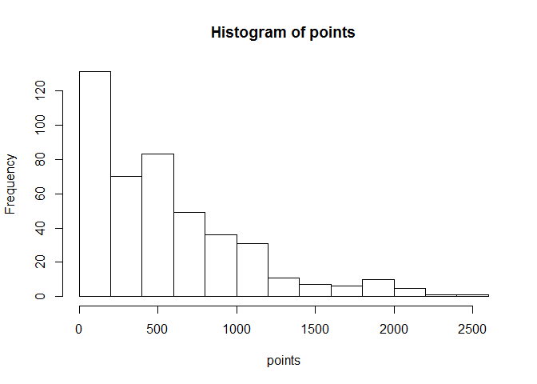
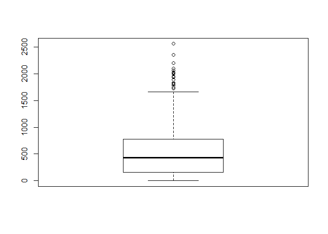
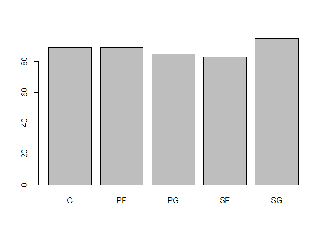

Untitled
================
Pinshuo Ye
9/10/2017

Downloading Rdata from the Internet
-----------------------------------

Here we download the Rdata to the computer.

``` r
# assembling url (so it fits on the screen)
github <- 'https://github.com/ucb-stat133/stat133-hws-fall17/'
repo <- 'raw/master/warmup02/data/nba2017-salary-points.RData'

download.file(
  url = paste0(github, repo),
  destfile = "nba2017-salary-points.RData")
```

Loading the data
----------------

Loading the data and it will shows the list of values on the right.

``` r
# load the objects
load("nba2017-salary-points.RData")

# list the available objects
ls()
```

    ##  [1] "experience" "github"     "player"     "points"     "points1"   
    ##  [6] "points2"    "points3"    "position"   "repo"       "salary"    
    ## [11] "team"

Data Analysis
-------------

### Quantitive Data

This is a simple analysis of the quantitive data and the simple graphs.

``` r
# This is the basic information of the list 'points'
summary(points)
```

    ##    Min. 1st Qu.  Median    Mean 3rd Qu.    Max. 
    ##     0.0   156.0   432.0   546.6   780.0  2558.0

``` r
mean(points)
```

    ## [1] 546.6054

``` r
sd(points, na.rm = FALSE)
```

    ## [1] 489.0156

``` r
min(points)
```

    ## [1] 0

``` r
max(points)
```

    ## [1] 2558

``` r
median(points)
```

    ## [1] 432

``` r
quantile(points)
```

    ##   0%  25%  50%  75% 100% 
    ##    0  156  432  780 2558

-   This is the basic information about quantitive data "points".
-   Using the summery() function could create a table that shows the quartiles and means of the vector. The center of the data could be discribed in two ways, meadian and mean. The center median show the average level of the players, while the mean is the average of the players\` points.
-   The spread of the data is relatively big, since the standard deviation of the data "points" is about 489.
-   And the max value of the vector could be considered as an outlier, because the difference between the max and the mean is about 4 standard deviation.

``` r
# Creating the histiogram and images
hist(points)
```



``` r
boxplot(points)
```



-   The histogram of the "points" shows the frequency distribution of the vector, and the boxplot shows the quartiles of the vector.
-   The shaoe of the histogram is not symmetric, but it skewed to the right.
-   This graph can approximately show the median.
-   Using the boxplot and the histogram can see the range of the data.
-   We can find out the outliers using the boxplot, is approximately over 1800.

``` r
# This is the basic information of the list 'points'
summary(points1)
```

    ##    Min. 1st Qu.  Median    Mean 3rd Qu.    Max. 
    ##    0.00   21.00   58.00   92.47  120.00  746.00

``` r
mean(points1)
```

    ## [1] 92.46712

``` r
sd(points1, na.rm = FALSE)
```

    ## [1] 109.7949

``` r
min(points1)
```

    ## [1] 0

``` r
max(points1)
```

    ## [1] 746

``` r
median(points1)
```

    ## [1] 58

``` r
quantile(points1)
```

    ##   0%  25%  50%  75% 100% 
    ##    0   21   58  120  746

-   This is the basic summery data of the "points1", which is the free throw of the players.
-   The center of the data is median and mean: the median of the data represents the average level of the player\`s free throws; while the mean of the data represents the average points that player could get.
-   The spread of the data is fairly big, since the standard deviation is large, comparing to the mean value of the data.
-   The max number could be considered as the outlier, since the difference between the max number and the mean is about 6 standard deviation.

### Quanlitative variable

This is an analysis about the data of categories, which is about the position of the players.

``` r
# Picking one of the qualitative data
# making the vector a factor
factor(position)
```

    ##   [1] C  PF SG PG SF PG SF SG SF PF PF C  SG PG C  C  SF PG PF C  SG SG SF
    ##  [24] PG PF SG PG SF SF C  SF SG PG SG SF PG C  C  PG C  SG SF PF PF PF SF
    ##  [47] SG PG PF C  C  C  PG C  PF SF SG SG PG SF PG C  PF PG SF PF PG SF C 
    ##  [70] PF PF SF SG SF C  PF SG C  SF SG PG PF PF SG PF C  SG PG C  SF PF PG
    ##  [93] PG PF SG PF SG C  SF PF PF SG PF PG C  SG SG SG PG SF C  PG PF SF PG
    ## [116] C  SG PG C  PF PF SG SF SF PF SG PG C  SG C  C  C  PG C  SG PF PG PF
    ## [139] SG SF SG SF PG SF PF PG PG PF PF C  SG PF PG SG PF SF C  SG PG SG SF
    ## [162] PG SG PG C  SG PF C  PF C  PF SF SG SG C  SF C  PG PG SF PG SG PF SG
    ## [185] SG SF C  SG C  SF PF PF SG C  PG C  SF SG C  SF PG C  PG C  SF PF SG
    ## [208] C  SF PG PG SG C  SF PF SG SF SG PG PF SF C  C  PF SG PF C  SF C  SG
    ## [231] SF SG PG PG C  SG SG PF PF PG C  C  SG SF SG PF SG PG C  PG PG C  C 
    ## [254] SG PG PG PF SG C  SG PF SF SF SF SF SG PF PF PF PG C  C  SG SG SF C 
    ## [277] SF PG SF SG PF PG PF PG SF C  SF SF PF PG SG C  PG PF SG SF PF SF C 
    ## [300] SF PF SF PF PG PG PG C  PF SG PG PF SF C  SF PF PF C  PG SG SG SF PG
    ## [323] SG PF SF SG SG PG PF SF SF C  SF PF PF SG PG SG SF PF PG SG SG PG PF
    ## [346] PF SG C  SF C  C  SG SF C  C  SF PF SF C  PF SG SG PG C  PG SF PG C 
    ## [369] SG PG PF PF C  PF PG PF C  SF C  PG SG PG PF SG SG SG PG SG C  C  PG
    ## [392] SG SF PF PG SF C  PF SF SG C  PF C  C  PG PF SF PG SF PG SG SF SF PG
    ## [415] SG C  SG PF PF SF SF SG C  PF C  PG C  C  SG SF SG PF SG PG PF SG PF
    ## [438] PG SF PG C 
    ## Levels: C PF PG SF SG

``` r
# making the frequency table
table(position)
```

    ## position
    ##  C PF PG SF SG 
    ## 89 89 85 83 95

``` r
#get the relative frequency
position.freq = table(position)
position.relfreq = position.freq/length(position)
position.relfreq
```

    ## position
    ##         C        PF        PG        SF        SG 
    ## 0.2018141 0.2018141 0.1927438 0.1882086 0.2154195

``` r
#barchart
barplot(table(position))
```



-   It is hard to tell the shape of the barchart, since the number of each position is alomost the same.
-   This is not a quantitive data, so there is no way to organize the data type and order them from the largest to the smallest. Then the data "position" has no center.
-   The spread is hard to find since there is no standard deviation.
-   There are no outliers in the qualitative data.

Process Report
--------------

-   It is a little bit challenging when we trying to transform the frequency table to relative frequency table, because we cannot just simply divide the table by the length of the vector.
-   Everything else is easy, since most of the functions we use to deal with the data could be found by searching.
-   There is no error in this section, but if I have some error about the ploting the graph, it may hard to fix.
-   The most time-consuming part is writing the comment and analysis of the graph, because comparing with creating data and sketch the graph, writing comment taking up more time.
